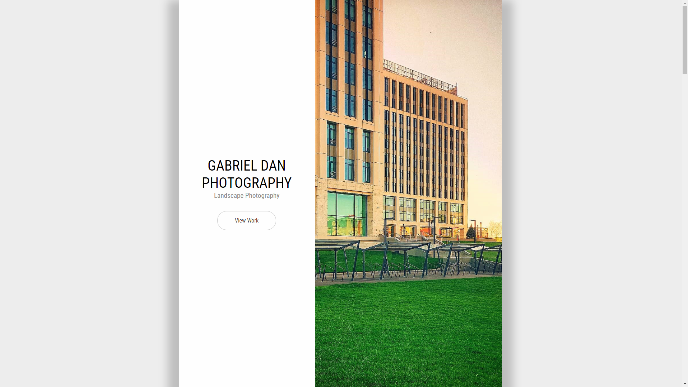

# Mobile-Responsive-Single-Page-Website
• Technologies used: HTML5, CSS3 and jQuery 
   
(!) The Instagram hyperlink logo at the bottom of the page was set up on purpose to send the user on instagram.com, not to a specific account.

Fully functional page through GitHub Pages [here](https://gabrieldan92.github.io/Mobile-Responsive-Single-Page-Website/).
